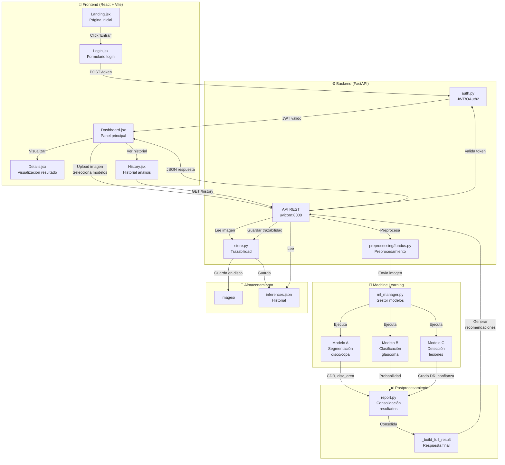
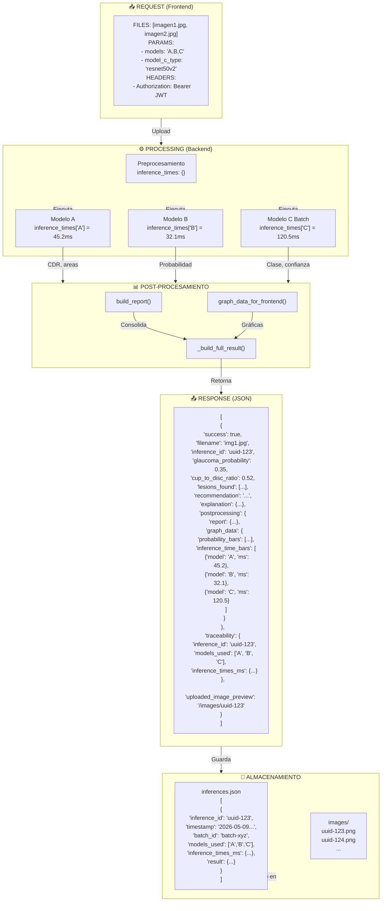
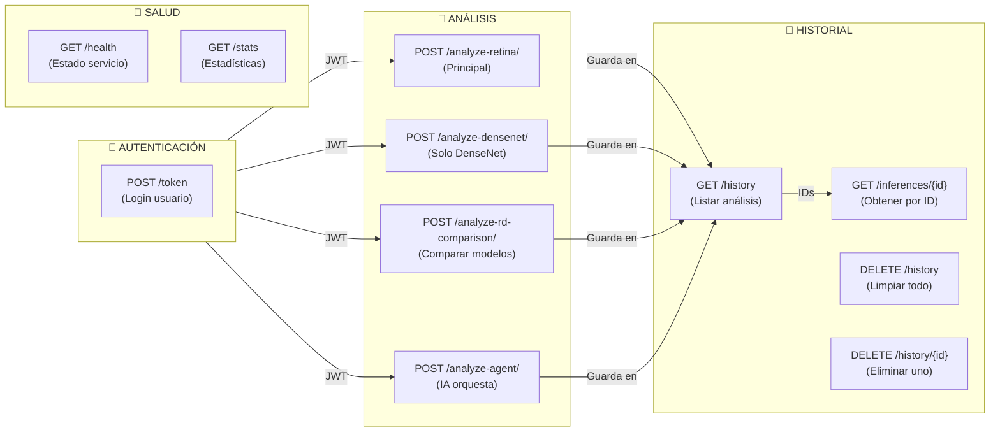

# 🔄 Diagramas Visuales del Sistema

## 1. Diagrama de Arquitectura General



---

## 2. Flujo de Inferencia Detallado (Paso a Paso)

```mermaid
sequenceDiagram
    actor U as Usuario
    participant FE as Frontend<br/>React
    participant API as Backend<br/>FastAPI
    participant Auth as auth.py<br/>JWT
    participant Store as store.py<br/>Almacén
    participant Prep as fundus.py<br/>Preproc.
    participant ML as ml_manager.py<br/>Modelos
    participant Report as report.py<br/>Postproc.

    U->>FE: 1. Ingresa credenciales
    FE->>API: POST /token
    API->>Auth: Validar usuario
    Auth->>FE: JWT token
    FE->>FE: Guarda token localStorage

    U->>FE: 2. Upload imagen + Modelos A/B/C
    FE->>API: POST /analyze-retina/
    Note over API: con Authorization header

    API->>Auth: ✅ Valida JWT
    API->>API: Lee imagen bytes

    API->>Store: Guarda imagen a disco
    Store->>Store: /data/images/{uuid}.png

    API->>Prep: preprocess_fundus()
    Prep->>Prep: 1. Canal verde<br/>2. CLAHE<br/>3. Ben Graham
    Prep->>API: Imagen preprocesada

    par Modelo A
        API->>ML: Ejecuta segmentación
        ML->>ML: segment_optic_disc()
        ML->>API: {cdr: 0.52, disc_area: 2.1}
    and Modelo B
        API->>ML: Ejecuta glaucoma
        ML->>ML: predict_glaucoma()
        ML->>API: probabilidad: 0.35
    and Modelo C (Batch)
        API->>ML: predict_batch([img1, img2, ...])
        ML->>ML: Stack tensor (N, 224, 224, 3)
        ML->>ML: model.predict(batch)
        ML->>API: [{predicted_class: 2, conf: 85%}, ...]
    end

    API->>Report: build_report()
    Report->>Report: Consolida etiquetas<br/>probabilidades
    Report->>API: Reporte estructurado

    API->>API: _build_full_result()
    API->>API: Generar recomendaciones<br/>clínicas
    API->>Store: save_inference()
    Store->>Store: /data/inferences.json
    Store->>API: inference_id

    API->>FE: JSON respuesta<br/>con resultados
    FE->>Details: Visualizar gráficas<br/>recomendaciones
    Details->>U: 3. Mostrar resultado
```

---

## 3. Flujo de Preprocesamiento

```mermaid
graph LR
    Input["📷 Imagen Original<br/>BGR 768×768"]
    
    Green["🟢 Canal Verde"]
    CLAHE["⚪ CLAHE"]
    Ben["⬇️ Ben Graham"]
    Output["✅ Listo ML<br/>1 canal 512×512"]

    Input -->|extract_green_channel<br/>img[:, :, 1]| Green
    Green -->|apply_clahe<br/>cv2.createCLAHE| CLAHE
    CLAHE -->|ben_graham_normalize<br/>GaussianBlur - img| Ben
    Ben --> Output

    style Input fill:#e1f5ff
    style Green fill:#c8e6c9
    style CLAHE fill:#f3e5f5
    style Ben fill:#fff3e0
    style Output fill:#c8e6c9
```

---

## 4. Arquitectura de ML - Los 3 Modelos

```mermaid
graph TB
    Input["🖼️ Imagen Preprocesada"]

    Input -->|Resize 512×512| ModelA["Modelo A: V-Net<br/>Segmentación"]
    Input -->|Resize 512×224| ModelB["Modelo B: Red Simple<br/>Clasificación"]
    Input -->|Resize 512×224<br/>BATCH| ModelC["Modelo C: ResNet50/DenseNet<br/>Clasificación DR"]

    ModelA -->|Máscara<br/>Segmentación| OutA["📊 Salida A<br/>CDR: 0.52<br/>disc_area: 2.1<br/>cup_area: 1.1"]

    ModelB -->|Logits| OutB["📊 Salida B<br/>glaucoma_prob: 0.35"]

    ModelC -->|Logits [5]| OutC["📊 Salida C<br/>predicted_class: 2<br/>confidence: 85%<br/>diagnosis: 'DR Mod.'"]

    OutA -->|build_report()| Report["📋 Reporte<br/>Consolidado"]
    OutB -->|graph_data()| Report
    OutC --> Report

    Report -->|_build_full_result()| Final["🎯 Resultado Final<br/>Recomendaciones<br/>Gráficas"]

    style ModelA fill:#e3f2fd
    style ModelB fill:#f3e5f5
    style ModelC fill:#fce4ec
    style Report fill:#fff9c4
    style Final fill:#c8e6c9
```

---

## 5. Flujo de Batching (Modelo C)

```mermaid
graph LR
    User["👤 Usuario"]

    User -->|Upload<br/>img1, img2, img3| API["📮 POST<br/>/analyze-retina/"]

    API -->|Lee bytes<br/>img1, img2, img3| ML["ml_manager<br/>.predict_batch()"]

    ML -->|Preprocesa<br/>cada imagen| P1["📷 img1<br/>224×224"]
    ML -->|Preprocesa<br/>cada imagen| P2["📷 img2<br/>224×224"]
    ML -->|Preprocesa<br/>cada imagen| P3["📷 img3<br/>224×224"]

    P1 -->|np.stack()| Batch["🔗 Tensor Batch<br/>Shape: 3, 224, 224, 3"]
    P2 --> Batch
    P3 --> Batch

    Batch -->|⚡ 1 inferencia<br/>model.predict| GPU["🎮 GPU/CPU<br/>ResNet50"]

    GPU -->|Logits [5]×3| PostProc["🔄 Post-proc<br/>argmax, softmax"]

    PostProc -->|Result 1<br/>class: 1<br/>conf: 78%| R1["✅ Resultado 1"]
    PostProc -->|Result 2<br/>class: 2<br/>conf: 92%| R2["✅ Resultado 2"]
    PostProc -->|Result 3<br/>class: 0<br/>conf: 95%| R3["✅ Resultado 3"]

    R1 --> API
    R2 --> API
    R3 --> API

    API -->|JSON array| User

    style Batch fill:#fff176
    style GPU fill:#ffccbc
```

---

## 6. Estructura de Datos - Flujo JSON



---

## 7. Flujo de Autenticación

```mermaid
graph LR
    User["👤 Usuario"]
    Frontend["Frontend<br/>App.jsx"]
    API["Backend<br/>FastAPI"]
    Auth["auth.py"]
    UserDB["users.json"]
    JWT["JWT Token"]
    Storage["localStorage"]

    User -->|Ingresa user/pass| Frontend
    Frontend -->|POST /token| API
    API -->|OAuth2PasswordRequestForm| Auth
    Auth -->|Busca usuario| UserDB
    UserDB -->|Retorna hash<br/>contraseña| Auth
    Auth -->|verify_password()| Auth
    Auth -->|Validación OK| JWT
    JWT -->|Token generado| API
    API -->|Bearer token| Frontend
    Frontend -->|Guarda| Storage
    
    User -->|Accede a análisis| Frontend
    Frontend -->|Incluye token en<br/>Authorization header| API
    API -->|Valida JWT| Auth
    Auth -->|Token válido| API
    API -->|Respuesta autorizada| Frontend

    style User fill:#e1f5ff
    style Frontend fill:#fff9c4
    style API fill:#c8e6c9
    style Auth fill:#f3e5f5
    style JWT fill:#ffccbc
```

---

## 8. Flujo de Historial

```mermaid
graph TB
    Dashboard["Dashboard.jsx<br/>Componente Dashboard"]
    Tabs["Tabs:<br/>Upload | History"]
    HistoryPage["History.jsx"]
    API["GET /history?limit=20"]
    Store["store.py<br/>list_inferences()"]
    JSON["inferences.json"]
    Table["<br/>Tabla con análisis previos<br/>Fecha | Modelos | Prob. Glaucoma | CDR | Grado DR<br/>"]
    Detail["Clic en fila"]
    DetailAPI["GET /inferences/{inference_id}"]
    DetailView["Details.jsx<br/>Visualiza análisis"]

    Dashboard -->|Usuario hace clic| Tabs
    Tabs -->|Selecciona History| HistoryPage
    HistoryPage -->|useEffect()| API
    API -->|Query| Store
    Store -->|Lee| JSON
    JSON -->|Retorna array| Store
    Store -->|Retorna últimas 20| API
    API -->|JSON array| HistoryPage
    HistoryPage -->|Renderiza| Table
    Table -->|Usuario hace clic| Detail
    Detail -->|Obtiene ID| DetailAPI
    DetailAPI -->|Query| Store
    Store -->|Busca por ID| JSON
    JSON -->|Retorna objeto| Store
    Store -->|Retorna| DetailAPI
    DetailAPI -->|JSON completo| DetailView
    DetailView -->|Visualiza<br/>con gráficas| Dashboard

    style HistoryPage fill:#fff9c4
    style Table fill:#c8e6c9
    style DetailView fill:#c8e6c9
```

---

## 9. Flujo Completo del Sistema (Macro)

```mermaid
graph TB
    Start["🚀 INICIO<br/>Usuario accede app"]

    Start -->|No autenticado| Login["🔐 LOGIN<br/>frontend/src/pages/Login.jsx"]
    Login -->|POST /token| Auth["✅ AUTENTICACIÓN<br/>backend/auth.py<br/>JWT generado"]
    Auth -->|Token en localStorage| Dashboard["📊 DASHBOARD<br/>frontend/src/pages/Dashboard.jsx"]

    Dashboard -->|Pestaña Upload| Upload["📤 UPLOAD IMAGEN<br/>Selecciona archivo<br/>Elige modelos A/B/C"]
    Upload -->|POST /analyze-retina/| Analyze["⚙️ ANÁLISIS<br/>backend/main.py"]

    Analyze -->|Preprocesa| Prep["🔧 PREPROCESAMIENTO<br/>backend/preprocessing/fundus.py<br/>Canal verde + CLAHE + Ben Graham"]

    Prep -->|Ejecuta| ModelA["🤖 MODELO A<br/>Segmentación disco/copa<br/>backend/models/segmentation_vnet.py"]
    Prep -->|Ejecuta| ModelB["🤖 MODELO B<br/>Clasificación glaucoma<br/>backend/models/glaucoma_classifier.py"]
    Prep -->|Ejecuta BATCH| ModelC["🤖 MODELO C<br/>Clasificación DR<br/>backend/ml_manager.py"]

    ModelA -->|CDR| Combine["📋 CONSOLIDACIÓN<br/>backend/postprocessing/report.py"]
    ModelB -->|Probabilidad| Combine
    ModelC -->|Grado DR| Combine

    Combine -->|build_report()| Build["🎯 CONSTRUCCIÓN RESULTADO<br/>backend/main.py (_build_full_result)"]
    Build -->|Generar recomendación<br/>Generar explicación| Final["✅ RESULTADO FINAL<br/>JSON estructurado"]

    Final -->|Guardar trazabilidad| Store["💾 ALMACENAMIENTO<br/>backend/store.py"]
    Store -->|inferences.json| JSON["📁 /data/inferences.json"]
    Store -->|Imagen| IMG["📁 /data/images/{uuid}.png"]

    Final -->|Retorna| Details["👁️ DETALLES<br/>frontend/src/pages/Details.jsx<br/>Visualiza resultado + gráficas"]

    Details -->|Ver historial| History["📜 HISTORIAL<br/>frontend/src/pages/History.jsx"]
    History -->|GET /history| Hist["📊 TABLA DE ANÁLISIS<br/>Todos los análisis previos"]

    Hist -->|Clic en fila| DetailAPI["🔍 DETALLES PREVIOS<br/>GET /inferences/{id}"]
    DetailAPI -->|Lee JSON| Details

    Details -->|Más análisis| Dashboard
    Dashboard -->|Logout| Start

    style Start fill:#c8e6c9
    style Login fill:#bbdefb
    style Auth fill:#bbdefb
    style Dashboard fill:#fff9c4
    style Upload fill:#fff9c4
    style Analyze fill:#ffe0b2
    style Prep fill:#f8bbd0
    style ModelA fill:#d1c4e9
    style ModelB fill:#d1c4e9
    style ModelC fill:#d1c4e9
    style Combine fill:#c5e1a5
    style Build fill:#c5e1a5
    style Final fill:#a5d6a7
    style Store fill:#ffccbc
    style JSON fill:#cfd8dc
    style IMG fill:#cfd8dc
    style Details fill:#ffccbc
    style History fill:#ffccbc
    style Hist fill:#ffccbc
```

---

## 10. Tabla Resumen de Endpoints API



---

## 11. Stack Tecnológico Visual

```
┌─────────────────────────────────────────────────────────┐
│                    PLATAFORMA COMPLETA                   │
├─────────────────────────────────────────────────────────┤
│                                                           │
│  ┌──────────────────┐      ┌──────────────────┐          │
│  │   FRONTEND       │◄────►│    BACKEND       │          │
│  │  React + Vite    │ JSON │  FastAPI + Async │          │
│  │  Tailwind CSS    │ HTTP │   Python 3.10+   │          │
│  │  Framer Motion   │      │                  │          │
│  │  Lucide Icons    │      │                  │          │
│  └──────────────────┘      └──────────────────┘          │
│                                    │                      │
│                                    │                      │
│                            ┌───────▼────────┐            │
│                            │   MACHINE      │            │
│                            │  LEARNING      │            │
│                            │                │            │
│                            │ • TensorFlow   │            │
│                            │ • Keras        │            │
│                            │ • NumPy/OpenCV │            │
│                            │ • Scikit-learn │            │
│                            └────────────────┘            │
│                                    │                      │
│                                    │                      │
│  ┌──────────────────────────────────────────────────┐   │
│  │            ALMACENAMIENTO                        │   │
│  │  • JSON (/data/inferences.json)                  │   │
│  │  • Imágenes (/data/images/)                      │   │
│  │  • Usuarios (/data/users.json)                   │   │
│  └──────────────────────────────────────────────────┘   │
│                                                           │
│  ┌──────────────────────────────────────────────────┐   │
│  │      DEPLOYMENT & ORQUESTACIÓN                   │   │
│  │  • Docker (Backend + Frontend)                   │   │
│  │  • Docker Compose (Orquestación)                 │   │
│  │  • Nginx (Reverse proxy en producción)           │   │
│  │  • PowerShell/Bash (Scripts de inicio)           │   │
│  └──────────────────────────────────────────────────┘   │
│                                                           │
│  ┌──────────────────────────────────────────────────┐   │
│  │     OPCIONALES (Extensibilidad)                  │   │
│  │  • Claude API (Agente cerebro)                   │   │
│  │  • Triton Server (Modelos ONNX)                  │   │
│  │  • PostgreSQL (Producción)                       │   │
│  └──────────────────────────────────────────────────┘   │
│                                                           │
└─────────────────────────────────────────────────────────┘
```
